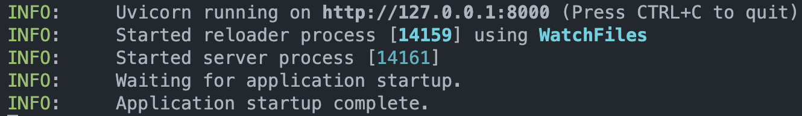

# SeedZero Backend 2023

## Prerequisites

- [Python >= 3.7](https://www.python.org/downloads/)
  - (Mostly recommended) [miniconda](https://docs.conda.io/en/latest/miniconda.html)
- Docker
  - [Docker Desktop for Windows/Mac/Linux](https://www.docker.com/products/docker-desktop)
  - [Docker Engine for Linux](https://docs.docker.com/engine/install/)
- MongoDB (Mostly recommended to use Docker)
  - [MongoDB Docker Image](https://hub.docker.com/_/mongo)
    - Download with run ```docker pull mongo``` in Terminall/Shell
  - [MongoDB Community Server](https://www.mongodb.com/try/download/community)

## After Miniconda installion
You must run this command in Terminal or Powershell to initialize conda
### Windows (In Miniconda Command Prompt)
```powershell
conda init powershell
conda init cmd.exe
```
### Mac/Linux (Unix)
```bash
$ ~/miniconda3/bin/conda init bash
$ ~/miniconda3/bin/conda init zsh
```

## Caution
You should create an new environment for this project to avoid conflict with other project.
```bash
$ conda create -n seedzero-2023 python=3.11
$ conda activate seedzero-2023
```
## Try FastAPI

### Install dependencies

```bash
$ pip install "fastapi[all]"
$ pip install beanie # Database
```


### Example Coding API that response "Hello World"

#### 1. Create main.py

```python
from fastapi import FastAPI

app = FastAPI()

@app.get("/") # Say that the method is GET method and the path is "/" (root path)
def hello_world():
  return "Hello World"
```

### 2. Use uvicorn run FastAPI with this command in terminal/shell
```bash
$ uvicorn main:app --reload
```
#### Example output of uvicorn when start complete 


If you see the output like this, you can access to [http://localhost:8000/](http://localhost:8000) to see the result.
